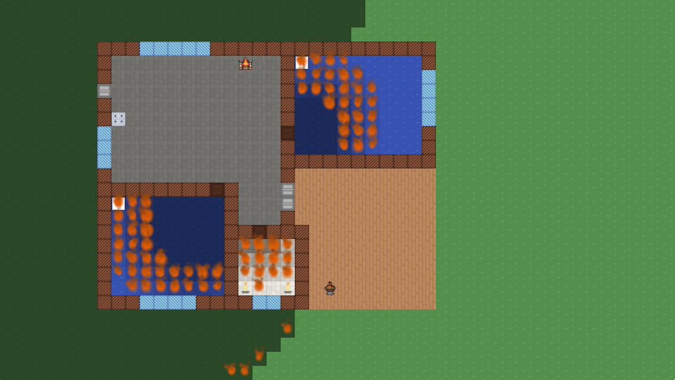

About Insurance Automata
========================

<p align="center">
  
</p>

<!-- centered link -->
<p align="center">
  <a href="https://insurance-automata.com">https://insurance-automata.com</a>
</p>

Insurance Automata is an interactive application that simulates the
spread of fire across a house using a cellular automata model. The app
allows users to place objects within a virtual house and observe how a
fire might spread under various conditions. It was developed as an entry
into the [2023 Hacktuary
Challenge](https://www.casact.org/article/2023-cas-hacktuary-challenge-hack-back),
a competition organized by the [Casualty Actuarial Society
(CAS)](https://www.casact.org/) to encourage the development of
applications that utilize actuarial concepts to solve pressing risk
management problems related to property insurance.

I developed Insurance Automata as a solo project over the course of 3
months in my spare time (mainly early morning on the weekends). I was
inspired by the concept of digital twin technology, which is used in the
manufacturing industry to create virtual replicas of physical products.
I feel that digital twin technology has the potential to revolutionize
the insurance industry by allowing insurers to better understand and
manage risk. I hope that Insurance Automata will serve as a (super
basic) proof-of-concept for the use of digital twin technology in the
insurance industry.

As usual, I started with what seemed like a simple idea and ended up
with a quite a complex project. I had to learn a lot of new technologies
and concepts along the way, including:

-   Learning how to create 2D graphics scenes using PixiJS in a web
    browser
-   Realising that TypeScript is way too slow for a computationally
    intensive application like this and having to rewrite the whole
    simulation engine in Rust
-   Which meant starting to learn Rust! A language with a famously steep
    learning curve (although I am much more familiar with it than when I
    started, I still have massive amounts to learn, and I am sure my
    Rust code is terrible 🙂)
-   Learning how to use WebAssembly to run Rust code in a web browser
    (which is fantastic by the way)

I think Insurance Automata is valuable for these reasons:

1.  **Utility to the General Public**: Insurance Automata provides a
    valuable tool for homeowners to visualize and understand the
    potential spread of fire in their homes. By allowing users to place
    objects within a virtual house and observe how a fire might spread
    under various conditions, the app empowers users to make informed
    decisions about fire safety and risk management.
2.  **Quality of User Experience and Interface Design**: The app\'s
    user-friendly interface and interactive elements make it accessible
    to a wide audience, including those without a background in
    actuarial science or risk engineering. The cellular automata model
    provides a visually engaging way to simulate fire spread, enhancing
    the user experience.
3.  **Use of Quantitative Risk Analysis Concepts**: The app employs
    basic actuarial concepts and quantitative risk analysis techniques,
    such as the Poisson process for fire frequency simulation and
    deriving risk premiums based on expected losses. Interestingly,
    where actuarial concepts are usually based on historic data, this
    actually uses a simulation to generate the data and then derive the
    premiums.
4.  **Novelty of Approach**: Insurance Automata\'s use of a cellular
    automata model to simulate fire spread in a home by building what is
    essentially a super basic digital twin is a novel approach to
    property risk assessment I believe. In fact, I feel that with the
    advent of artificial intelligence and cloud computing, digital twin
    technology has immense potential in the insurance industry.
5.  **Transparency and Accessibility**: All code is publicly available
    under the Mozilla Public License version 2.0, and the app uses only
    publicly available data sources. The app is deployed and accessible
    via the internet, ensuring that it is easily accessible to a wide
    audience.

I hope you enjoy it as much as I enjoyed making it! If you have any
questions or comments, or just want to say hi, please feel free to
contact me on [LinkedIn](https://www.linkedin.com/in/cbalona/).

## For Developers

The frontend is contained in a Docker container so you will need to
install [Docker](https://www.docker.com/) to run it.

You will also need to have [Rust](https://www.rust-lang.org/) installed as well as
the [wasm-pack](https://rustwasm.github.io/wasm-pack/installer/) tool
for compiling Rust code to WebAssembly.

### Running the App

```bash
# Install dependencies
cd frontend
yarn install

# Run the app in development mode
yarn dev
```

### Compiling the Rust Simulation Engine

```bash
make simulation-engine
```